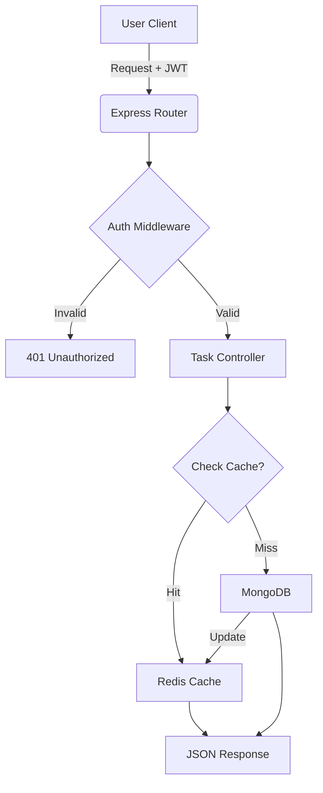

# 🎯 WLDD Backend: The Ultimate Task Hub

Hey there! 👋 Welcome to my backend project for the WLDD assignment. I've built this with a focus on **speed**, **security**, and **developer experience**. It's not just a "todo app"—it's a production-ready engine that handles auth, caching, and database state like a pro.

---

## 🌊 How Logic Flows

Here's a quick look at how a request travels through the app:



---

## 📸 API Showcase

Here's the API in action! This screenshot shows a successful user registration response:


---

## ✨ Features that Matter
- **Double-Layer Auth**: Secure JWT tokens paired with bcrypt password hashing.
- **Lightning Fast**: Redis caching layer helps scale the app without stressing the database.
- **Docker-First**: One command to rule them all. No more "it works on my machine" issues.
- **Tested to the Core**: High test coverage (70%+) ensures every feature stays working.

---

## 🛠️ Setting Up Your Space

### 1. Grab the code
```bash
git clone <repository-url>
cd Server
npm install
```

### 2. Configure the "Secret Sauce"
Copy the template and fill in your keys. I've left some hints in the file!
```bash
cp .env.example .env
```

### 3. Let's Go! 🚀
**The Pro Way (Docker)**:
If you have Docker running, just let it handle the heavy lifting:
```bash
npm run docker:build
```
*Your API will be chilling at `http://localhost:3000`.*

**The Local Way**:
If you prefer running everything on your metal:
```bash
npm run dev
```

---

## 🧪 The "No-Bug" Zone
I've spent a lot of time writing tests so you don't have to worry about breaking things.

- **Check everything**: `npm test`
- **Verify the coverage**: `npm run test:coverage`

---

## 🐳 Useful Docker Commands (Cheatsheet)
I've made some shortcuts to save you typing:
- `npm run docker:build`: Fresh start (build + run)
- `npm run docker:up`: Just turn it on
- `npm run docker:down`: Power off

---

## 📂 The Tour Guide
- `/src/config`: My connection logic (DB/Redis)
- `/src/controllers`: The "brain" of the app
- `/src/middlewares`: The gatekeepers (Auth)
- `/src/models`: The data blueprints
- `/src/tests`: My insurance policy (The specs)

---
*Made with ❤️ for the WLDD Team.*
